<p align="center">
  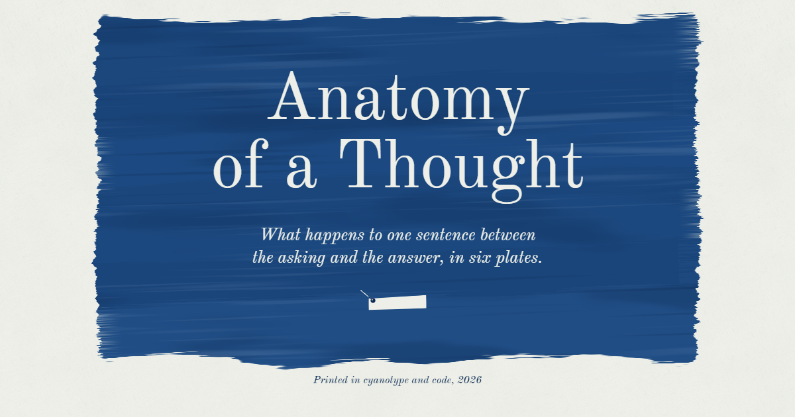
</p>

<h1 align="center">Anatomy of a Thought</h1>

<p align="center">
  <em>An illustrated atlas that follows one sentence through a language model:<br>tokens, meaning, attention and the answer.</em>
</p>

<p align="center">
  Six plates, printed as cyanotypes, that you scroll through like the pages of a book.
</p>

<br>

> **The trophy doesn’t fit in the suitcase because it’s too big. What’s too big?**
>
> You solved it without noticing. The atlas follows the same riddle through a machine, from the moment the sentence arrives to the moment the answer is printed, and shows what happens at each step.

It is designed as a nineteenth-century scientific atlas whose plates are cyanotypes: the Prussian-blue sun prints Anna Atkins made in 1843 for *Photographs of British Algae*. In a cyanotype, paper is brushed with a pale yellow-green sensitiser, turns blue wherever light reaches it, and stays white wherever an object lies on it. Every plate here is made the same way. Fields are brushed on, exposed and developed around their subject as you scroll, and at the very end the print is toned.

<br>

## The six plates

<table>
  <tr>
    <td width="50%" valign="top">
      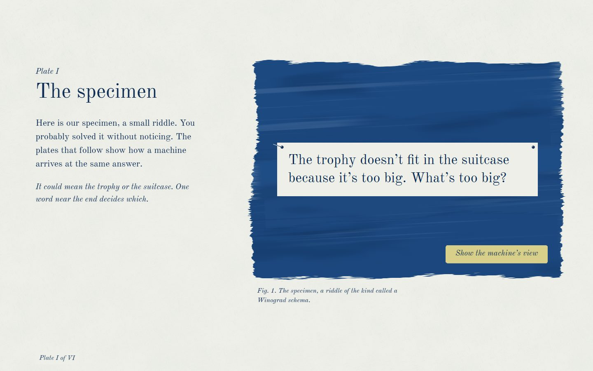
      <p><strong>Plate I. The specimen</strong><br>The riddle, set on a pinned paper slip. As the field exposes around it, the sentence becomes a white silhouette.</p>
    </td>
    <td width="50%" valign="top">
      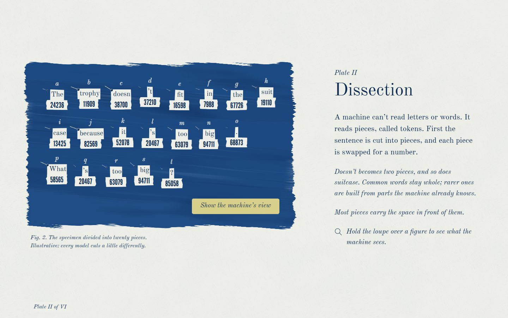
      <p><strong>Plate II. Dissection</strong><br><em>Tokens.</em> The slip is cut into twenty pieces. Each is pinned, lettered a to t, and swapped for a number on a strip of ticker tape.</p>
    </td>
  </tr>
  <tr>
    <td width="50%" valign="top">
      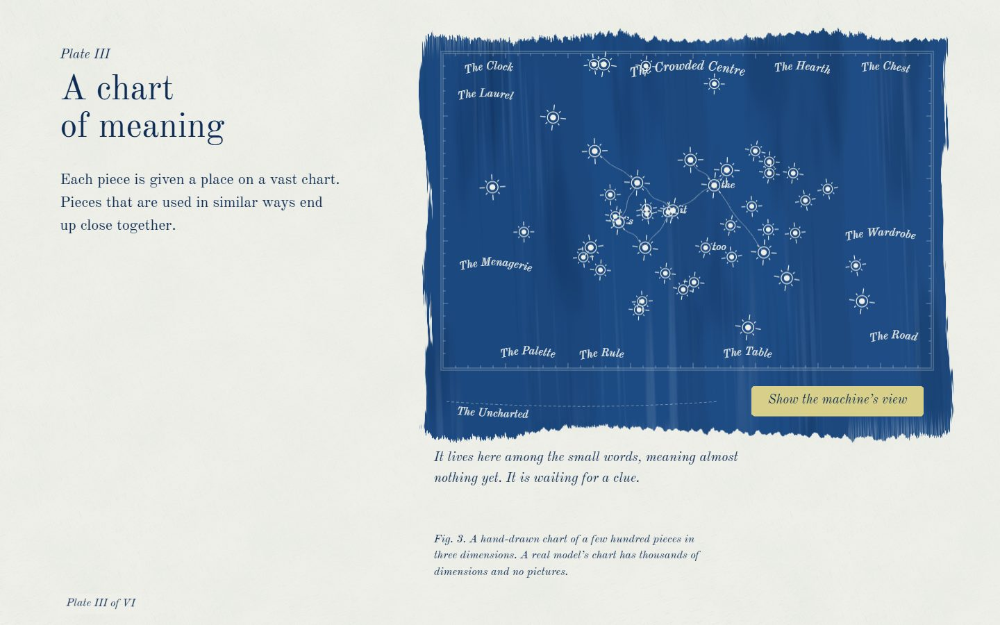
      <p><strong>Plate III. A chart of meaning</strong><br><em>Embeddings.</em> Every piece is a star on a hand-drawn celestial chart, where pieces used in similar ways sit close together. The camera visits five constellations.</p>
    </td>
    <td width="50%" valign="top">
      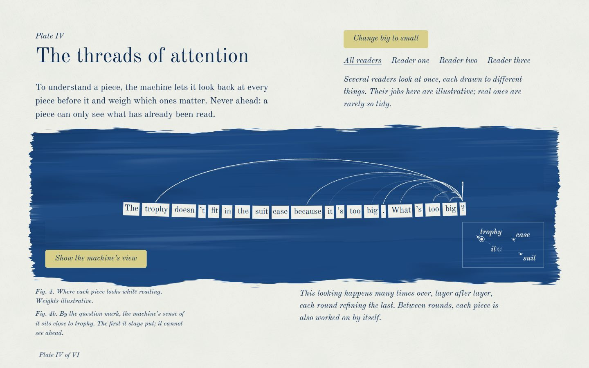
      <p><strong>Plate IV. The threads of attention</strong><br><em>Attention.</em> A reading needle moves along the sentence, and threads tie each piece back to the pieces before it that matter. Never ahead.</p>
    </td>
  </tr>
  <tr>
    <td width="50%" valign="top">
      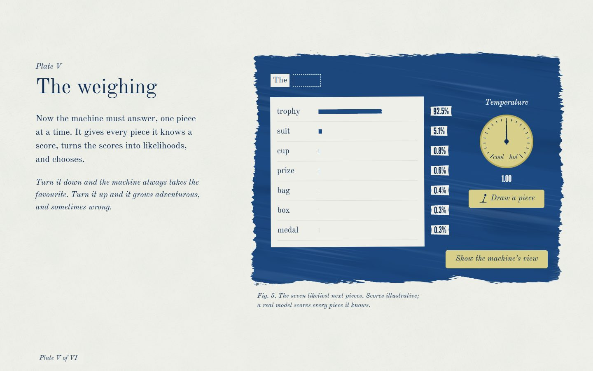
      <p><strong>Plate V. The weighing</strong><br><em>Prediction.</em> Scores become likelihoods through a real softmax. Turn the temperature, and pull the lever to draw the next piece.</p>
    </td>
    <td width="50%" valign="top">
      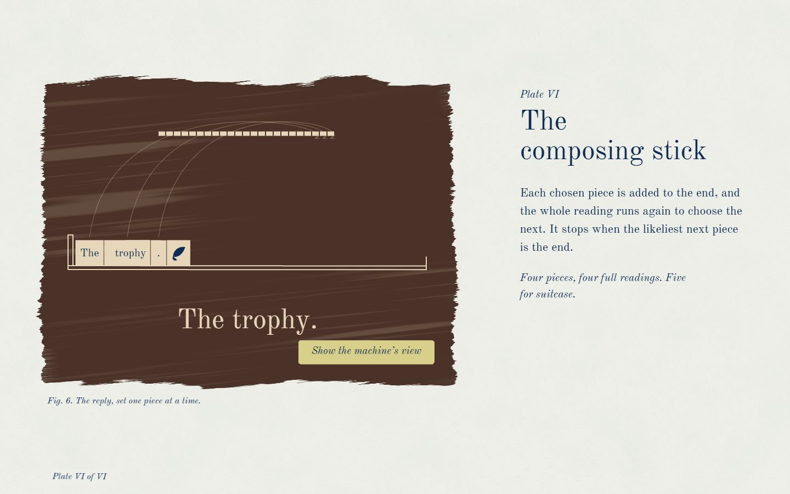
      <p><strong>Plate VI. The composing stick</strong><br><em>The loop and the answer.</em> Each chosen piece is set in metal and the whole reading runs again. When the end mark drops in, the print tones to umber.</p>
    </td>
  </tr>
</table>

<br>

## Two voices

The atlas speaks in two voices. **The naturalist** narrates in words, plainly and precisely, set in Old Standard TT. **The machine** speaks only in numbers, the IDs, coordinates, weights and scores it actually handles, set in League Gothic on narrow paper strips like telegraph tape.

The drawings are for you; the numbers are what the machine works with. **The loupe** moves between the two. Hold it over any figure to see the machine's view beneath, or press *Show the machine’s view*.

<table>
  <tr>
    <td width="50%" valign="top">
      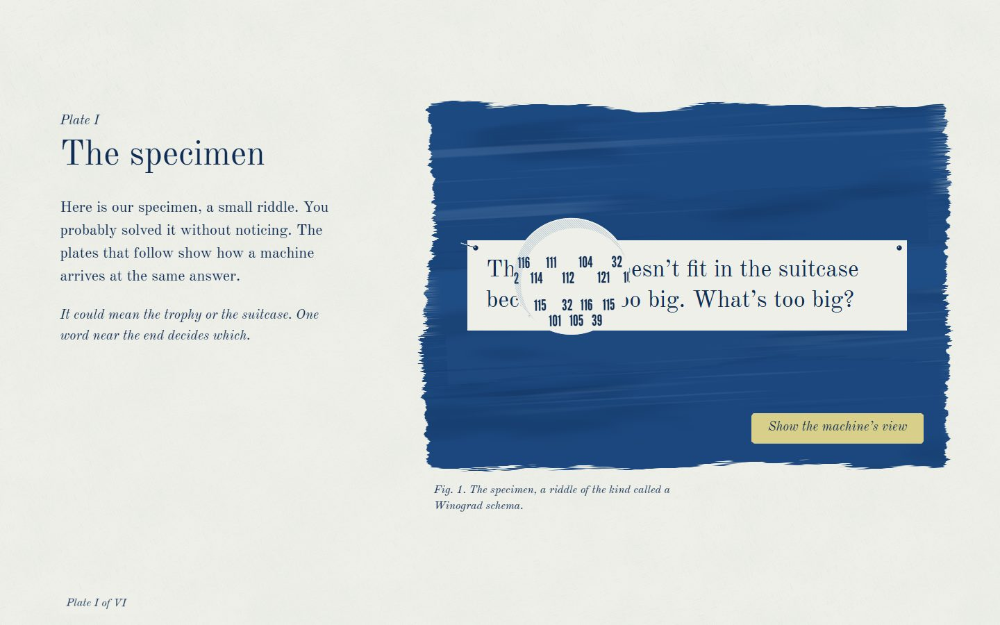
      <p align="center"><em>The loupe over Plate I: the sentence as the machine receives it, one number for each character.</em></p>
    </td>
    <td width="50%" valign="top">
      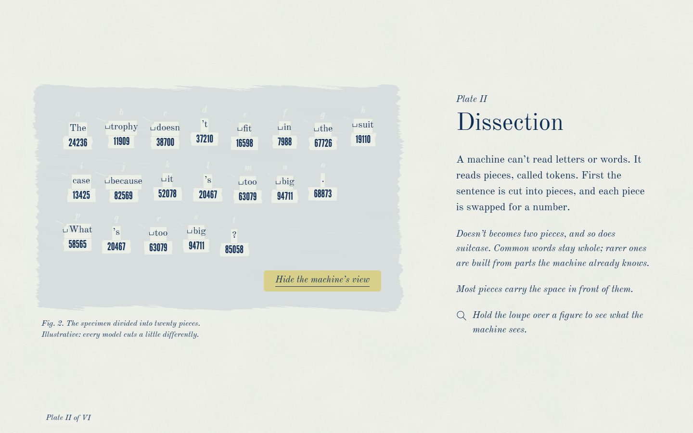
      <p align="center"><em>Plate II in the machine's view: each piece with its space and its number.</em></p>
    </td>
  </tr>
</table>

<br>

## Things to try

- **Lay down a sentence of your own** on Plate II. It is cut, pinned and numbered like the specimen, and its pieces are ringed on Plate III's chart, or set at *The Uncharted* if the chart doesn't know them.
- **Fly the chart.** On Plate III, press a constellation's name and the camera travels there.
- **Change *big* to *small*** on Plate IV. The strongest threads swing from *trophy* to *suitcase*, and the change carries through to the answer. It is kept in the address as `#small`.
- **Choose a reader.** Several readers (attention heads) look at once, each drawn to different things.
- **Turn the temperature** on Plate V. Cool, and the machine always takes the favourite; hot, and it grows adventurous, and sometimes wrong.
- **Pull the lever** to draw a piece, and watch the tally of the last ten draws.
- **Scroll back up** past Plate VI's end mark, and the toning washes out again.

<br>

## On a phone

On a narrow screen each plate becomes a single column, in the order of a book: the title, the intro, the figure, its caption, then the notes. Only the figure holds still while its sequence plays. Plate IV stands its sentence on end, with the threads bowing out to one side. The loupe opens with a press and hold.

<p align="center">
  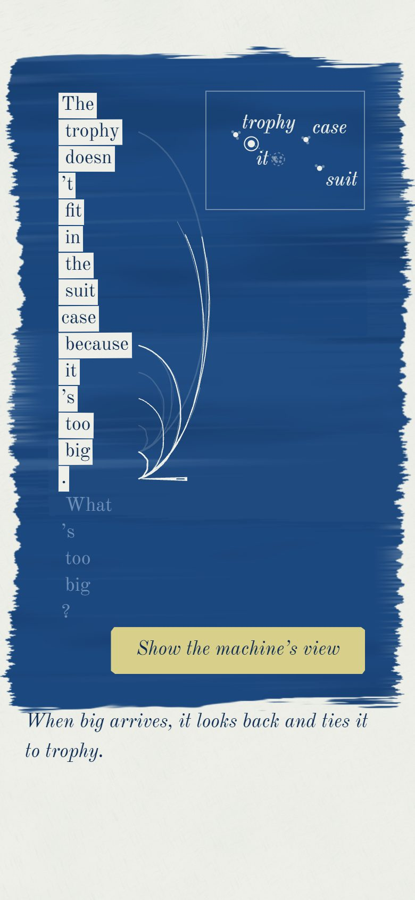
  &nbsp;
  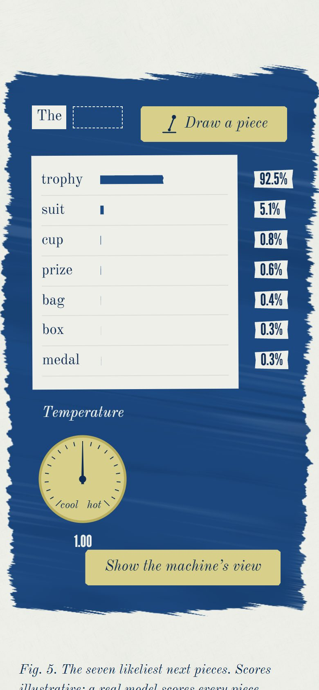
  &nbsp;
  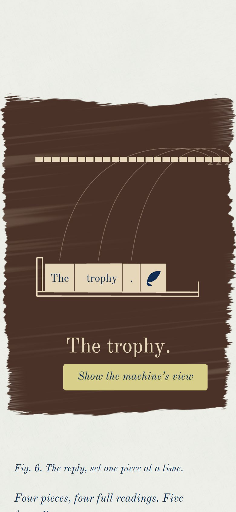
</p>

<br>

## Made like a cyanotype

The whole site moves by one grammar, taken from the process. **Nothing appears for no reason.** Every motion is one of eight physical verbs:

| Verb | What happens on the page |
|---|---|
| **brush** | A field is brushed on in three or four broad, uneven strokes |
| **expose** | The field turns from yellow-green to blue, centre first, around whatever lies on it |
| **cut** | A dashed line is drawn at pen speed and the slip parts along it |
| **pin** | A piece is laid down and a pin pressed in |
| **thread** | Cotton is laid from piece to piece; its width is its weight |
| **weigh** | A bar exposes to its likelihood; a needle swings |
| **set** | Type and numbers are set with a press: fast in, a dead stop, a one-pixel recoil |
| **tone** | The finished print bathes from blue to umber, and paper to cream |

The story is tied to your scrolling; your own actions get immediate answers. Only the title page moves on its own, for three seconds, and any key, click or scroll skips it.

<br>

## For every reader

- **Every figure is also text.** Each plate's figure is followed by the machine's view as a real table, the chart has a *List the stars*, and the whole atlas reads in order without JavaScript.
- **Every control works from the keyboard,** with a visible focus ring, in reading order. The constellation names, the reader tabs and the temperature dial included.
- **Changes are announced** to screen readers: the variant switch, each piece drawn, your own sentence exposed.
- **Reduced motion** shows every plate developed and still, with its lines already drawn; the loupe still works.
- **Checked by script:** 371 screenshots across a laptop and a phone, in normal, reduced-motion and no-WebGL renders, with zero axe violations and 173 behaviour checks. The layout is swept in Chromium, Firefox and WebKit at six screen sizes, down to 360px wide and a phone turned on its side.

<br>

## Under the hood

A vanilla site, with no framework and no UI kit. All the content lives in semantic HTML in `index.html`, and TypeScript enhances it.

| | |
|---|---|
| **Build** | Vite and TypeScript (strict) |
| **Motion** | GSAP 3: ScrollTrigger, SplitText, DrawSVGPlugin, CustomEase, Flip and InertiaPlugin, with six custom eases |
| **Scrolling** | Lenis, driven by the GSAP ticker and synced to ScrollTrigger |
| **Paper and fields** | A raw WebGL2 fragment shader, no library: the paper is baked once into a tile, and each brushed field is drawn into its own canvas |
| **The chart** | three.js, for Plate III only, loaded as you approach it; an SVG chart stands in without WebGL |
| **Type** | Old Standard TT and League Gothic, self-hosted, with metric-matched fallbacks so nothing shifts as they load |
| **Checking** | Vitest, Playwright, axe-core and Lighthouse |

**How the paper is drawn.** One shader, built twice: once for the paper and once for the fields, compiled side by side in the background so the page doesn't wait on the GPU. While a field is changing it is drawn as a quick draft. Once the page is still, it is drawn again at full sharpness. A field is redrawn only when its state changes, never merely because you scrolled.

**Measured** on a laptop with integrated graphics (Intel UHD): about 72 KB of JavaScript on first load, gzipped; 60 frames a second scrolling the whole atlas (59.6 measured), with no long tasks while scrolling; no layout shift. Lighthouse on desktop scores 100 for performance, accessibility, best practices and SEO.

<details>
<summary><strong>Where things are</strong></summary>

```
index.html                  all the content, readable without JavaScript
src/
  main.ts, boot.ts          start-up: fonts, scrolling, the paper, the plates
  state.ts                  the variant (big or small) and the reader's sentence
  gl/                       the paper-and-chemistry shader and its fields
  plates/                   one module per plate, each with init() and destroy()
    chart/                  Plate III's three.js chart, SVG fallback and lettering
    threads/                Plate IV's row, threads and inset
    weighing/, composing/   Plates V and VI
  components/               the loupe, ticker strips, pins, the plate indicator, drawn marks
  data/                     the specimen, its pieces and IDs, attention weights, scores, the chart
  lib/                      the tokeniser, softmax, hashing, projection
  motion/                   eases, durations, scrolling, reduced motion
  styles/                   tokens, base, type, components and plates
scripts/                    screenshots and checks (see below)
public/                     favicon, touch icon, Open Graph image, robots.txt
```
</details>

<br>

## Run it locally

You need Node 20 or newer.

```sh
npm ci
npm run dev          # http://localhost:5173
```

Add `?debug` to the address for a panel of the palette, eases and shader settings, or `#small` to open the atlas on the variant.

```sh
npm run build        # type-checks, then builds to dist/
npm run preview      # serves the build
npm test             # the tokeniser, the data, softmax and projection
```

<details>
<summary><strong>The checking scripts</strong></summary>

<br>

The checks that need browsers use Playwright's (`npx playwright install chromium firefox webkit`).

| Script | What it does |
|---|---|
| `npm run shots` | Screenshots every sequence and interaction at 1440 × 900 and 390 × 844, in normal, reduced-motion and no-WebGL renders; runs axe on each and 173 behaviour checks |
| `npm run sweep` | Chromium, Firefox and WebKit at six sizes, a resize from 1920 to 360 and back, and a phone turned on its side |
| `npm run keyboard` | Tabs through the whole page, works every control with keys alone, and writes out the accessibility tree |
| `npm run proof` | Proofreads the copy: quotes, dashes, spelling, figure numbers, widows, and line lengths at six widths |
| `npm run perf` | Load and scroll performance on your own GPU, with slow frames counted as each plate arrives |
| `npm run lighthouse` | Lighthouse's mobile and desktop audits |
| `npm run og` | The Open Graph image and the touch icon |
| `npm run readme-images` | The pictures in this README |
| `node scripts/film.mjs` | A filmstrip of the whole atlas, top to bottom, to read its rhythm |

</details>

<br>

## Deploying

The site is static: `npm run build` writes everything to `dist/`, with relative paths, so it works at a domain's root or under a project path.

Link previews need absolute addresses, so give the build the site's address:

```sh
SITE_URL=https://your-domain.example/ npm run build
```

**Vercel:** import the repository, keep the Vite preset (build `npm run build`, output `dist`), and add a `SITE_URL` environment variable.

<details>
<summary><strong>GitHub Pages</strong></summary>

<br>

Set **Settings, Pages, Source** to **GitHub Actions**, and add this as `.github/workflows/deploy.yml`:

```yaml
name: Deploy to GitHub Pages
on:
  push:
    branches: [main]
  workflow_dispatch:
permissions:
  contents: read
  pages: write
  id-token: write
concurrency:
  group: pages
  cancel-in-progress: true
jobs:
  build:
    runs-on: ubuntu-latest
    steps:
      - uses: actions/checkout@v4
      - uses: actions/setup-node@v4
        with:
          node-version: 22
          cache: npm
      - run: npm ci
      - run: npm test
      - run: npm run build
        env:
          SITE_URL: https://adityak-2727.github.io/anatomy-of-thought/
      - uses: actions/upload-pages-artifact@v3
        with:
          path: dist
  deploy:
    needs: build
    runs-on: ubuntu-latest
    environment:
      name: github-pages
      url: ${{ steps.deployment.outputs.page_url }}
    steps:
      - id: deployment
        uses: actions/deploy-pages@v4
```
</details>

<br>

## A note on accuracy

The atlas explains how large language models work in general: text is split into tokens; each token becomes a vector, and tokens used in similar ways sit close together; attention lets each position draw only on the positions before it, over many layers; the last position scores every token the model knows; one is chosen; and the loop runs until an end token is chosen. It makes no claims about any particular model. The pieces, IDs, positions, weights and scores are hand-made to tell the story truthfully, and every figure that shows them is marked *illustrative*. Whether any of this amounts to a thought is a question for another atlas.

<br>

## Credits

Designed and built by **Aditya**.

- Type: **Old Standard TT** by Alexey Kryukov, and **League Gothic** by The League of Moveable Type, both under the SIL Open Font License.
- After **Anna Atkins**, *Photographs of British Algae: Cyanotype Impressions* (1843), and the natural-history plates and celestial atlases of the nineteenth century.
- Built with GSAP, Lenis, three.js and simplex-noise.

<br>

<p align="center"><em>Every mark in the atlas, each star, thread and letter, is drawn by code. There are no photographs.</em></p>
